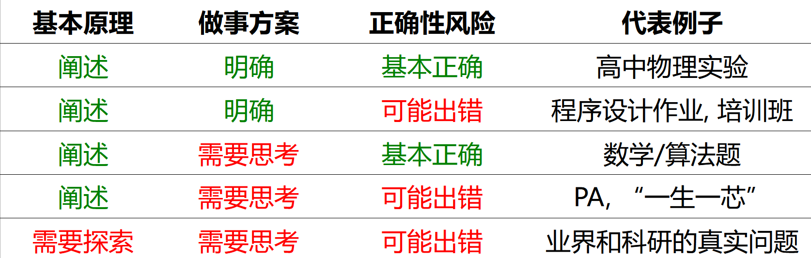

# Talk 10.18 [Published Version]

# P2 What you can do

- Break and talk: what do you want to do in your 4 yrs?

## P2.0 You have to know the law

- Fully reading your *Student Manual.*
- Find flaws in the manual
- Small quiz:
    - Do you know *MianXiuBuMianKao*? How much? Who permit?
    - Are you allow to have *Maoism* this semester? Are you allow to quit *Maoism* this semester?
    - What if you go for a exchange student program? How about your credit?
    - What if you get caught by your tutor when you escape from a class? What if you annoy your tutor? (do not try)
    - What is your class monitor?
    - What if you find yourself forget to attend a exam?
        - How to cope with the situation when 10min after the beginning? 20min after the beginning? after the exam? when you check your transcript?
        - Is your college life over? Is your dream over?
        - How to maximize the GPA through retaking? (what is the retaking policy?)
    - Can you ask teacher to give you more score? less score?

You *Student Manual* is a **rule system*.*** 

The complexity of the rule system is $O(n^2)$. → **No one can design the manual soundly!**

**What you can do is much more than you imagined.** 

## P2.1 Absolutely, learning

### Take courses

**Listen to the lecturer**

I did not listen the lecturer the whole Second-year semester. (So do not feel so guilty)

You should know that the class is always low-quality.

BUT you have listen to the teacher SOMETIMES.  

‘Sometimes’: There may be many ***useless but in the exam*** content. (may or may not, ask the seniors!) And some of the courses have records (you can 2x it, like ADA).

(Example of Computer Network here)

**Do assignments**

Not much to say, finish them all!

Most assignment has answer. collect them and correct your assignments!

BUT finish it by yourself!

**Finish labs**

You may not know what is lab before. Just as above, so do not be afraid. There is no *hard* thing!

And you may encounter a confusing thing: lab report.

(DLCO Report here) 

*To juan or not to juan, that is a question.*

When you involute, you should bear two ideas

- You must know the appetite of the scorer (Fully discussed below)
- You must accept much effort (the crisis you can only lower but not eliminate)

**Groupwork**

The more people, the less efficiency.

Least and trusted people if you can finish it.

**Examination**

Exam-oriented learning is nessesary.

Some exercises, mock paper, problem style…

How to ? The seniors!

### Main problem in your courses: Unknown

Teacher and TAs like **Unknown.**

(Not all the TA is as kind as me… lol, DLCO here)

You are confused by the scoring standard, the required content in the exam…

- If you do not know the content, you have to listen to him/her and fulfill their vanity. (RESPECT!) (Good teacher gives you the right of choice or ensure their course’s quality)
- If the scoring standard is ambiguous (‘5% according to your novelty…’), the students may feel  scared about the part and get blind involuted in the assignment.
Suspicion chain: the students do not know quality of others so get involuted and involuted! (Prisoner’s dilemma)
When something wrong happens, they may not challenge me and suspect themselves. (low responsibility, you have nothing to do with him, evaluation, remark…) (they do not put their feet into students’ shoes)
- most students get 90+ and exceeds 30% limit? request is troublesome, lower their scores quietly!
how to lower? Just substract a constant / distinguish students with acceptance time (although students are queueing randomly)
    
    Your scaring score is just statistics in their view. (They could just apply a **same(but not reasonable)** policy on the course)
    
- If I do not public the scores until the final score, so no one will question my scoring! I could just score the reports by sum of page! (That’s REAL! a story here)
    
    Transparency means the teacher is ready for any question! But few people can achieve that.
    students may feel worried… BUT who cares?
    nobody like argument! people are lazy…
    
- How to deal with ? Look into the blackbox! (Seniors and ‘make them happy’(do not cause problem for them(like hard to read)) and ‘Be different’(be a peacock!))

### Self-learning

If you have spare time & motivation to learn the knowledge well (if not do not feel stressed, just do it when you are free), you are expected to learn the best corresponding course in the world.

(This practice may be exhausted for the content may not be the same and you should finish the lab)

**csdiy.wiki, Bilibili…**

**Foreign Internet: Google, stackoverflow, Github, Copilot, Blogs, English Textbooks, Good tutorial videos(like 3b1b)…**

Coursera → certificate

it is actually fucking.

What you actually need to learn is ***how achieve anything by yourself***.

**Mind experiment:** 

How to play Minecraft in Minecraft with a cellphone staying 10m away from you?

Find path, find problem, find solution, find sub-question…

（太难翻译了，写汉语了。。。）

## P2.2 Working

Note that we do not take your passion into account here.

如果你想评奖（奖学金，下详述）评优（三好学生，优生优干）或者更进一步，这些是必须的也是有用的，就不赘述。

如果你想认识更多的人，social，找饭搭子，找一起出去玩的，找对象…… 那肯定也是有用的。(别上四年就认识三个室友吧)

**Free work**

校团委，校学生会，校青协，校招办，系团委，系学生会，系青协，团学联，班级干部，帮导员干活… （上述有一部分是给钱的）

对于我们专业，都没用。而且一些东西“对于有些人是有用的”，所以你需要忍受大量的尸位素餐、官僚主义等现象。校级每年换届都会出现互撕挂人。

会稍微提高一点点你的0.25形势与政策的得分。

**Funded work**

勤工俭学：很多机会。比较丰富的资源，应该也有一些文职工作，注意时薪25左右，远低于当家教。不过如果没有生活需要的话，不建议，CS挺忙的。

TA: 有的老师需要招募本科生助教。注意：一般来说比较忙，属于是事多钱少的（那种好的一般轮不到本科生来干）

## P2.3 A step forward (join the party)

这个我不太懂，总之就是各种进步，请详询导员。

## P2.4 Activities & Societies

呢喃活动和社团还是非常多的，自己去找就可以了。

也可以看看汉口路和食堂门口的海报，以及表白墙上。

毛概和习概实践，建议在大一暑假完成，注意提前立项！

## P2.5 Scholarship

GPA is almost everything. Research is important

But to be honest, scholarship is the most useless among all these things.

## P2.6 Competitions & Certificates

For GPA, a Full list：(xlsx here)

For your background, it is beneficial if 

- you are the core member and you have insight in the project
- among the most valuable  competitions.
- a national prize.

when

- 推免/保研
- foreign postgraduate program  with Chinese prof.

Away from Wild-chicken competition (都是千年的狐狸）

A good strategy: *THU-PKU Judgement

Do not take too much time on a certain competition with low reward. (like DaShuSai)

No any certificate in career is necessary in our major.

Two tips:

- Some competition are related to some courses, like 龙芯杯.
- Find a good advisor is the most important.

## P2.7 Exchange Study

best time for long semester

- 3-2, 4-1

Preparations

- CV, background
- **English Certificate: TOEFL/ IELTS:**
    - You must get the result at 2-summer (A bit earlier than your postgraduate program application, but necessary!)
    - The common application time of 3-2 program is often at September
- get the permission of the teacher for credit identification

2 functions:

- if you want to go abroad for further study: it is a good background and you can use the chance to find a RA position in the labs. (an opportunity to)
- it can improve your GPA obviously.

School will not filter student if you are self-funded

Info: Exchange student management system

## P2.8 Research※

1. Find a prof in NJU in related field **with nice reputation**

1-yr intern

I think the first advisor: younger profs are better

- more instruction
- aggressive in academic
- easy to communicate
1. Directed Intern

If you want to have your postgrad study at NJU:

- keep in that lab

If you want to learn in other Chinese Univs(Mainland, CAS, HK) or abroad:

- find the **corresponding** research intern opportunities in the region.

Notice:

- imply your intern period to him
- show your interest in becoming his/her studeif they are in your goal univ
- more discussion with the advisor (do not treat them as boss)
- contact them **before** the vacation!
- try to lead your own project at third year.
- be aggressive to get your reward(Undergrad are easy to be sacrificed when *dividing the cake*)
- big and small lab(example)

## P2.9 Well-being

- ask for help from others
- ask for help from the professionals.
- P2.9

## P2.10 Loving

哥，这条删了呗，我是无所谓的，没那么容易的，不轻易破防的，但是我一个朋友可能有点汗流浃背了，他不太舒服想睡了，当然不是我哈，我一直都是行的，以一个旁观者的心态看吧，也不至于破防吧，就是想照顾下我朋友的感受，他有点破防了，还是建议删了吧，当然删不删随你，我是没感觉的，就是为朋友感到不平罢了，也不是那么简单破防的

## P2.11 JUST TO DO WHAT YOU WANT

The 4 yrs is 4 yrs in the university, but most importantly, it is your 4 yrs in your life.

---

**if time permits**: let’s read the cultivation plan.

# Reference
Pictures from Talk on *OneStudentOneChip (or YiShengYiXin)* Lecture 0, Zihao Yu, CAS
